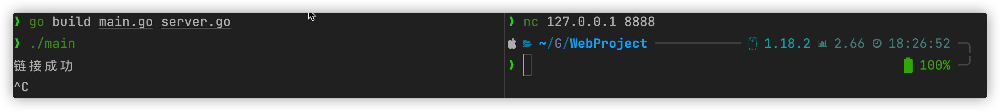
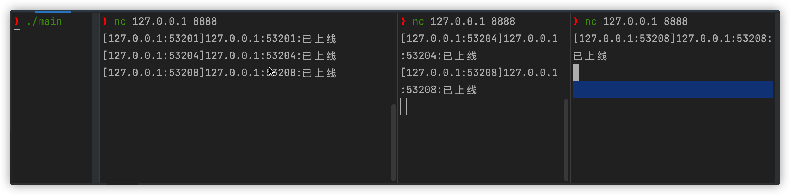
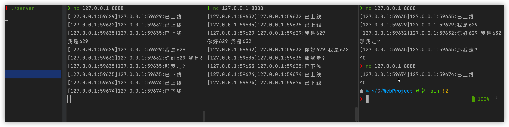
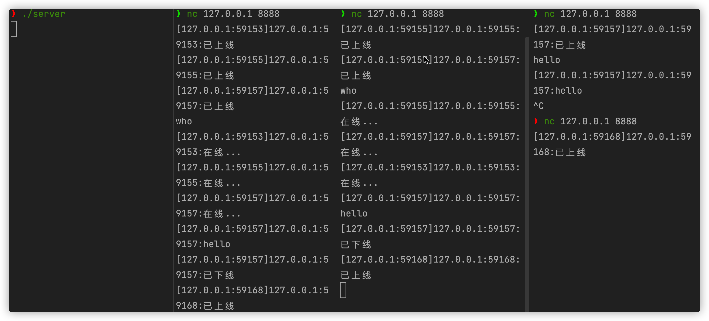
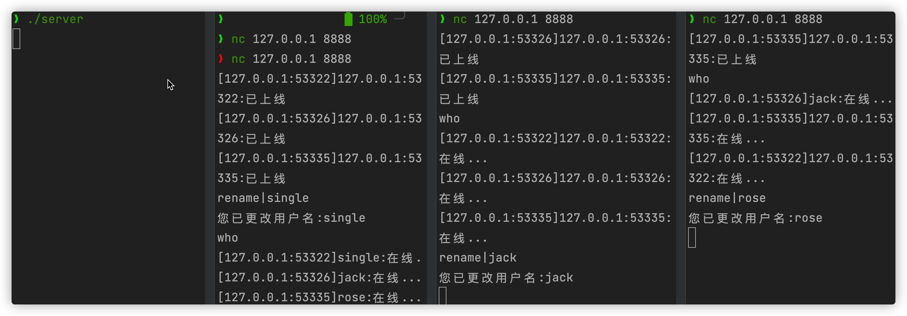

# go_web

> 这是一个新手go_web项目
>
> 用于实践一下技能
>
> 1.go web编程，实现一个web聊天室
>
> 2.git的版本控制
>
> 3.git的规范提交**type(scope) : subject** 

# V0.1 实现了server监听local:8888

# V0.2 实现用户上线广播功能 

# V0.3 实现用户消息广播

# V0.4 用户业务封装

对用户上线、下线和发送信息业务进行封装。

# V0.5 实现在线用户查询

# V0.6 实现修改用户名功能

